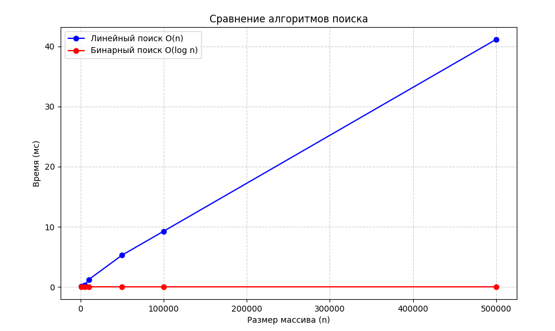
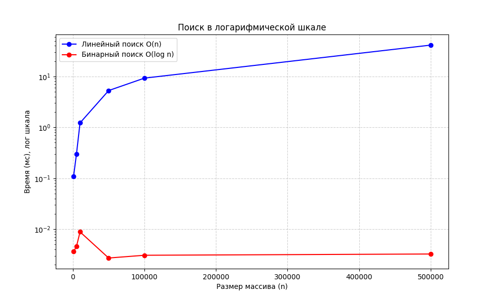

# Лабораторная работа 01: Введение в алгоритмы. Сложность. Поиск

**Дата:** 2025-10-20  
**Семестр:** 3 курс 2 полугодие - 6 семестр  
**Группа:** ПИЖ-б-о-23-1  
**Дисциплина:** Анализ сложности алгоритмов  
**Студент:** Постников Илья Викторович

## Цель работы
Освоить понятие вычислительной сложности алгоритмов. Получить практические навыки реализации и анализа линейного и бинарного поиска. Научиться экспериментально подтверждать теоретические оценки сложности O(n) и O(log n).

## Теоретическая часть

### Сложность алгоритма
Характеризует количество ресурсов (времени и памяти), необходимых алгоритму для обработки входных данных объема n.

### Асимптотический анализ
- Анализ поведения алгоритма при стремлении n к бесконечности
- Позволяет абстрагироваться от констант и аппаратных особенностей

### O-нотация («О-большое»)
- Верхняя асимптотическая оценка роста функции
- Определяет наихудший сценарий работы алгоритма

### Линейный поиск (Linear Search)
- Последовательный перебор всех элементов массива
- **Сложность:** O(n)

### Бинарный поиск (Binary Search)
- Поиск в отсортированном массиве путем многократного деления интервала поиска пополам
- **Сложность:** O(log n)
- Требует предварительной сортировки (O(n log n))

## Практическая часть

### Реализованные алгоритмы

#### Линейный поиск
- Перебор элементов массива последовательно
- В худшем случае проверяет все n элементов
- **Сложность:** O(n)

#### Бинарный поиск
- Работает только на отсортированном массиве
- На каждом шаге делит интервал поиска пополам
- Количество шагов пропорционально log₂(n)
- **Сложность:** O(log n)

### Подготовка данных
- Сгенерированы отсортированные массивы: [1000, 5000, 10000, 50000, 100000, 500000]
- Для поиска выбран последний элемент (худший случай для линейного поиска)
- Усреднение по 10 запускам для каждого измерения

### Характеристики системы
- **CPU:** Intel(R) Xeon(R) CPU E3-1270 v3 @ 3.50GHz
- **RAM:** 16 GB
- **OS:** Windows 10
- **Python:** 3.13

## Результаты экспериментов

### Таблица времени выполнения (миллисекунды)

| Размер (n) | Линейный поиск (мс) | Бинарный поиск (мс) | Отношение |
|------------|---------------------|---------------------|-----------|
| 1 000      | 0.0529              | 0.0019              | 27.8×     |
| 5 000      | 0.2698              | 0.0023              | 117.3×    |
| 10 000     | 0.5690              | 0.0025              | 227.6×    |
| 50 000     | 3.9183              | 0.0026              | 1507.0×   |
| 100 000    | 6.7459              | 0.0027              | 2498.5×   |
| 500 000    | 33.2160             | 0.0031              | 10714.8×  |

### Графики сравнения алгоритмов

**Анализ графика:**
- Линейный поиск демонстрирует линейный рост времени выполнения
- Бинарный поиск показывает логарифмическую сложность
- При больших n разница в производительности становится существенной

### График в логарифмической шкале

**Анализ:**
- В логарифмической шкале хорошо видна разница в асимптотическом поведении
- Линейный поиск продолжает демонстрировать линейный рост
- Бинарный поиск подтверждает логарифмическую сложность

## Анализ результатов

**Теоретически:**
- **Линейный поиск:** O(n)
- **Бинарный поиск:** O(log n)

**Экспериментально подтверждено:**
- Время линейного поиска растёт пропорционально n (0.0529 → 33.2160 мс, в 628 раз)
- Время бинарного поиска практически постоянно (0.0019 → 0.0031 мс, всего в 1.6 раз)
- При увеличении размера массива в 500 раз время линейного поиска выросло в 628 раз
- При увеличении размера массива в 500 раз время бинарного поиска выросло всего в 1.6 раз

### Ключевые наблюдения

1. **Экспоненциальный рост эффективности:** Отношение времени выполнения увеличивается с 27.8× до 10714.8×
2. **Практическая константность бинарного поиска:** Время выполнения почти не зависит от размера массива
3. **Линейная зависимость:** Увеличение размера массива в 5 раз приводит к увеличению времени линейного поиска примерно в 5 раз
4. **Критическая точка:** Уже при 50 000 элементов бинарный поиск в 1507 раз эффективнее

## Выводы

1. **Экспериментально доказано** различие в асимптотической сложности:
   - Линейный поиск: O(n) - подтвержден линейный рост
   - Бинарный поиск: O(log n) - подтвержден логарифмический рост

2. **Практическая значимость:** Для массива из 500 000 элементов:
   - Линейный поиск занимает 33.2 мс
   - Бинарный поиск занимает 0.0031 мс
   - **Бинарный поиск быстрее в 10 714 раз!**

3. **Рекомендации по применению:**
   - Для небольших массивов (< 1000) разница незначительна
   - Для средних массивов (10 000-50 000) бинарный поиск предпочтительнее
   - Для больших массивов (> 100 000) бинарный поиск обязателен

4. **Окупаемость сортировки:** Затраты на предварительную сортировку массива окупаются при многократных операциях поиска

5. **Работа показала важность выбора алгоритма** в зависимости от:
   - Размера данных
   - Структуры данных (отсортированность)
   - Требований к производительности

6. **Построены графики** в линейном и логарифмическом масштабе для наглядного сравнения алгоритмов

## Заключение

Проведенная работа наглядно продемонстрировала фундаментальное различие в производительности алгоритмов с разной асимптотической сложностью. Экспериментальные данные полностью подтвердили теоретические оценки, что подчеркивает важность анализа сложности алгоритмов при проектировании эффективных программных систем.
